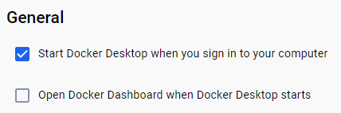
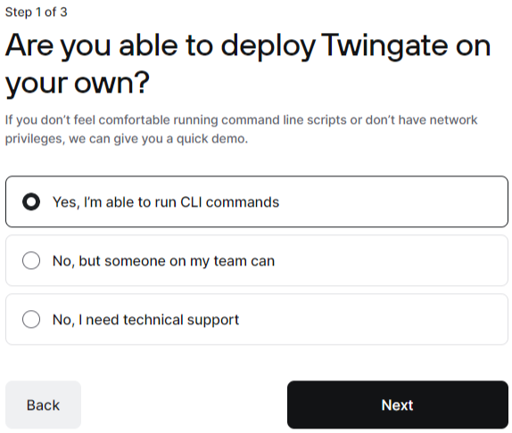
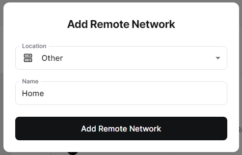
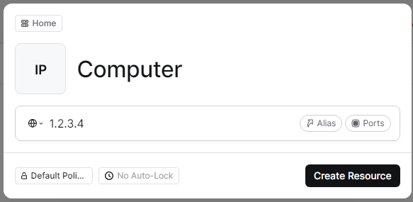
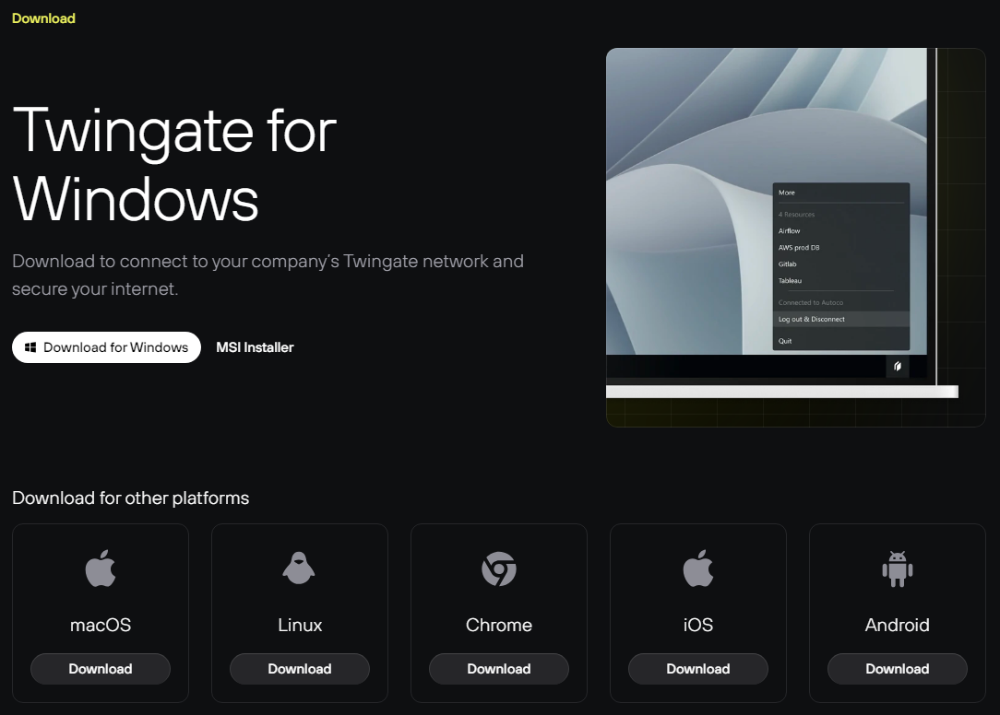
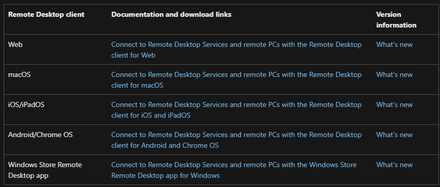

How to set up remote access to a Windows machine using Twingate
===============================================================

Have you ever had the situation where you have a computer at home or work that you want to be able to access without being physically in front of it? In that case remote access may be the solution for you! Remote access allows you to remotely access a computer, and can be set up without too much difficulty.

.. note::
   * This guide assumes that the main device you will connect to is running Windows 10/11 Professional
   * This method of remote access requires that your computer is permanently turned on. If your device turns off, you will not be able to connect to it.

-----------
Prerequites
-----------

Virtualization
~~~~~~~~~~~~~~

Virtualization needs to be enabled in this BIOS. This process will vary depending on your computer, so you may need to look up instructions for your specific model.

.. attention::
   Changing settings in your bios has the potential to lead to system instability or even make your system completely inoperable. Avoid changing settings if you do not know what they do.

Remote Desktop
~~~~~~~~~~~~~~

Remote Desktop also needs to be enabled in your Windows settings. `This guide from Microsoft <https://learn.microsoft.com/en-us/windows-server/remote/remote-desktop-services/clients/remote-desktop-allow-access#windows-10-fall-creator-update-1709-or-later>`_ shows you how to do so.

.. attention::
   Read the warning provided by Microsoft to understand the risks of enabling Remote Desktop `here <https://learn.microsoft.com/en-us/windows-server/remote/remote-desktop-services/clients/remote-desktop-allow-access#windows-10-fall-creator-update-1709-or-later>`_.

Docker Desktop
--------------

Navigate to the `Docker Desktop installation page <https://www.docker.com/products/docker-desktop/>`_ and download the installer.

.. attention::
   You will have to agree to the terms and conditions during the install process. Ensure you read and understand them before proceeding.

.. note::
   You may be asked to create an account, but you can skip this step.

Once the installer has been downloaded, run it and follow the installation instructions. Continue through the install with all default options until you get to the main screen.

The last thing we need to do in Docker is make sure that Docker will automatically start whenever Windows starts, so go to settings and check the ``Start Docker Desktop when you sign in to you computer`` box.

Twingate
--------

Navigate to `Twingate <https://twingate.com>`_ and sign up for an account.
Fill in the fields with the relevant information.

.. attention::
   You will have to agree to the customer agreement and privacy policy before continuing. Ensure you read and understand them before proceeding.

.. note::
   By default, Twingate gives new customers a business trial. For our purposes, we do not need any of the features of the business plan, so you are free to just let the trial expire. Since you have not provided any payment information, you don't need to worry about any fees.

Once you get to section with 3 questions, select ``Yes, I'm able to run CLI commands`` for the first one.

Pick the most relevant option for the second question, and make sure you have an acceptable name for your network for the third question.

Once all the account setup has been done, navigate to the dashboard and click the ``Add Remote Network`` button.

Choose location ``Other`` and name it.

After creating the network, navigate to `Remote Networks` and click on the network you just created.

Click ``Deploy Connector``, leave Docker selected for step 1, generate the tokens for step 2, leave everything unchecked for step 3, and copy the command given in step 4 by clicking the ``Copy Command`` button.

Open Command Prompt and paste in the command, and click enter to run it. This will create a docker container that will allow you to connect to your computer from anywhere.

Now we also need to find the local IP of your computer. To do this, navigate to your Windows settings, Network & internet, and either Ethernet or Wi-Fi, depending on which you are using. Find the field that says IPv4 address, and copy it.

We now will go back to Twingate and add your computer as a network resource.

From the network overview page, navigate to resources, and add a resource by clicking the ``+ Resource`` button.

Select the network to add the resource to, enter a name for the resouce, and paste in the IP address into the address field.

.. note::
   In most cases, especially if your device is using Wi-Fi, the IP address you have copied is not permanently assigned, and can change. You may want to look into a static IP assignment which can be done within your router settings.

Accessing your device
---------------------

Now that all the main setup steps are done, you are ready to access your device from anywhere in the world.

All that you need is to download Twingate and Remote Desktop on the device you will be using to access your main device, sign in to Twingate, and then enter the IP address of your main device into Remote Desktop and click connect.

Where Twingate is available:

Where Remote Desktop is available:

